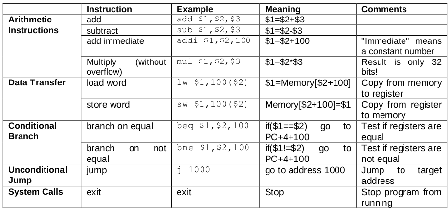

# MIPS-Simulator

A program that is a simulator of the 5 stage MIPS architecture written in c
the processor has a 1ko memory size , the first half of the memory is used to store the instructions and the second half is used to store the data

below is the structure of the MIPS 

and this is the instruction set

